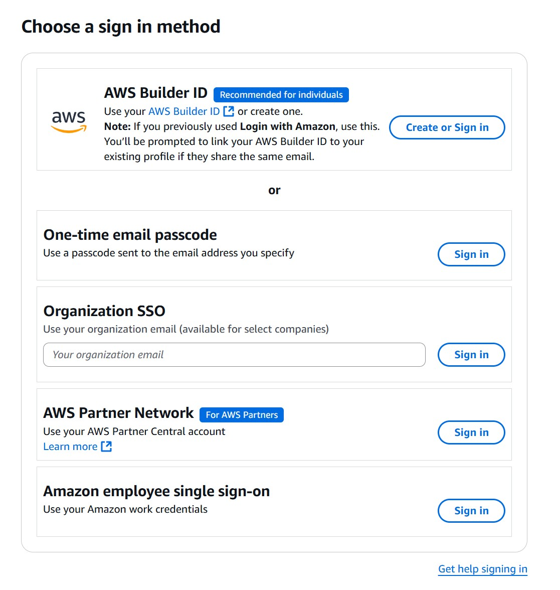

# MLOpsOct2025

## Class links
- [Access to lab and course materials](https://us-east-1.student.classrooms.aws.training/class/ilt%231YqMAD3yhyaA1zh4hhq2Zp): when you open this link, you will be prompted to signin. The preferred way is using "builder id". Problem is this tipically only works with personal emails. If you want to use your corporate account, choose One-time email password (preferred) or SSO. The SSO option eventually prevents us from working properly on the labs. Once registered, you will get an access denied error until I add you to the class. Please send me the email used to register through chat. Below is a screenshot with the options: 

## Expected pre-requisites
- [AWS Technical essentials](https://skillbuilder.aws/learn/K8C2FNZM6X/aws-technical-essentials/N7Q3SXQCDY) 

## Supplementary activities
- [Workbook activities doc](./MLOps_Engineering_on_AWS_Workbook_Customers.docx)

## Day 1 links
- DevOps Engineering on AWS and/or Practical Data Science with SageMaker course from [here](https://aws.amazon.com/training/classroom/)
- DevOps foundational info:
  - [10+ deploys per day at Flickr](https://www.youtube.com/watch?v=LdOe18KhtT4&t=12s)
  - [The Phoenix Project](https://www.amazon.com/Phoenix-Project-DevOps-Helping-Business-ebook/dp/B09JWVXFNG/)
  - [The DevOps Handbook](https://www.amazon.com/dp/B09G2GS39R/)
  - [The unicorn project](https://www.amazon.com/dp/B0812C82T9)
  - [Dora report](https://dora.dev/research/2024/dora-report/)
  - [Martin Fowler's take on the State of DevOps report](https://martinfowler.com/bliki/StateOfDevOpsReport.html)
  - [Accelerate book](https://www.amazon.com/dp/1942788339/)
- [Using Sagemaker Studio to build container images](https://aws.amazon.com/blogs/machine-learning/using-the-amazon-sagemaker-studio-image-build-cli-to-build-container-images-from-your-studio-notebooks/)
- [sm-docker CLI](https://github.com/aws-samples/sagemaker-studio-image-build-cli)
- [Sagemaker SDK repo](https://github.com/aws/sagemaker-python-sdk)
- [Sagemaker doc on readthedocs.io](https://sagemaker.readthedocs.io/en/stable/)
- [Repo with a lot of Sagemaker examples](https://github.com/aws/amazon-sagemaker-examples)
- [Sagemaker models available in the AWS marketplace](https://aws.amazon.com/marketplace/search/results?FULFILLMENT_OPTION_TYPE=SAGEMAKER_ALGORITHM&filters=FULFILLMENT_OPTION_TYPE)
- **[Sagemaker built-in algorithms](https://docs.aws.amazon.com/sagemaker/latest/dg/algos.html)**
- [Deciding how to use Docker containers for training and deploying models](https://docs.aws.amazon.com/sagemaker/latest/dg/docker-containers.html)
- [Sample sagemaker studio lifecycle configurations](https://github.com/aws-samples/sagemaker-studio-lifecycle-config-examples)
- [Using lifecycle configurations](https://aws.amazon.com/blogs/machine-learning/amazon-sagemaker-studio-and-sagemaker-notebook-instance-now-come-with-jupyterlab-3-notebooks-to-boost-developer-productivity/)
- [Dealing with multiple Sagemaker domains](https://docs.aws.amazon.com/sagemaker/latest/dg/domain-multiple.html)
- [EMR Serverless announcement](https://aws.amazon.com/blogs/aws/amazon-emr-serverless-now-generally-available-run-big-data-applications-without-managing-servers/)
- [Athena federated query](https://docs.aws.amazon.com/athena/latest/ug/connectors-available.html)
- [Whitepaper for ingesting data from SaaS applications into your data lake](https://docs.aws.amazon.com/whitepapers/latest/patterns-for-ingesting-saas-data-into-aws-data-lakes/patterns-for-ingesting-saas-data-into-aws-data-lakes.html)
- [Appflow supported applications](https://docs.aws.amazon.com/appflow/latest/userguide/app-specific.html)
- Lake Formation topics
  - [Tag-based access control](https://docs.aws.amazon.com/lake-formation/latest/dg/tag-based-access-control.html)
  - [Data filters](https://docs.aws.amazon.com/lake-formation/latest/dg/data-filtering.html)
  - [Lake Formation blueprints](https://docs.aws.amazon.com/lake-formation/latest/dg/workflows-about.html)
- [Online vs offline feature store](https://docs.aws.amazon.com/sagemaker/latest/dg/feature-store-storage-configurations.html)
- Hudi, Delta and Iceberg support on Glue
  - [Introducing native support for Apache Hudi, Delta Lake, and Apache Iceberg on AWS Glue for Apache Spark, Part 1: Getting Started](https://aws.amazon.com/blogs/big-data/part-1-getting-started-introducing-native-support-for-apache-hudi-delta-lake-and-apache-iceberg-on-aws-glue-for-apache-spark/)
  - [Introducing native support for Apache Hudi, Delta Lake, and Apache Iceberg on AWS Glue for Apache Spark, Part 2: AWS Glue Studio Visual Editor](https://aws.amazon.com/blogs/big-data/part-2-glue-studio-visual-editor-introducing-native-support-for-apache-hudi-delta-lake-and-apache-iceberg-on-aws-glue-for-apache-spark/)

## Day 2 links 
- [Using Sagemaker AI project templates](https://docs.aws.amazon.com/sagemaker/latest/dg/sagemaker-projects-templates-sm.html)
- [Walk Through a SageMaker AI MLOps Project Using Third-party Git Repos](https://docs.aws.amazon.com/sagemaker/latest/dg/sagemaker-projects-walkthrough-3rdgit.html)
- [Sagemaker AI operators for Kubernetes](https://docs.aws.amazon.com/sagemaker/latest/dg/kubernetes-sagemaker-operators.html)
- [SageMaker AI Components for Kubeflow pipelines](https://docs.aws.amazon.com/sagemaker/latest/dg/kubernetes-sagemaker-components-for-kubeflow-pipelines.html)
- [Sagemaker model cards](https://docs.aws.amazon.com/sagemaker/latest/dg/model-cards.html)
- 
